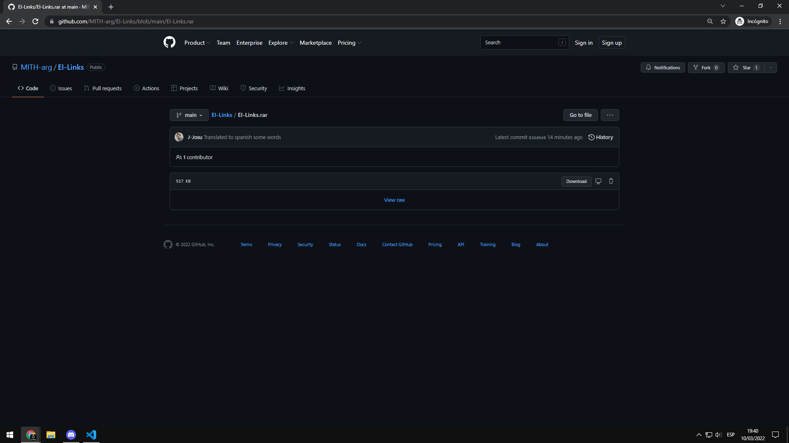
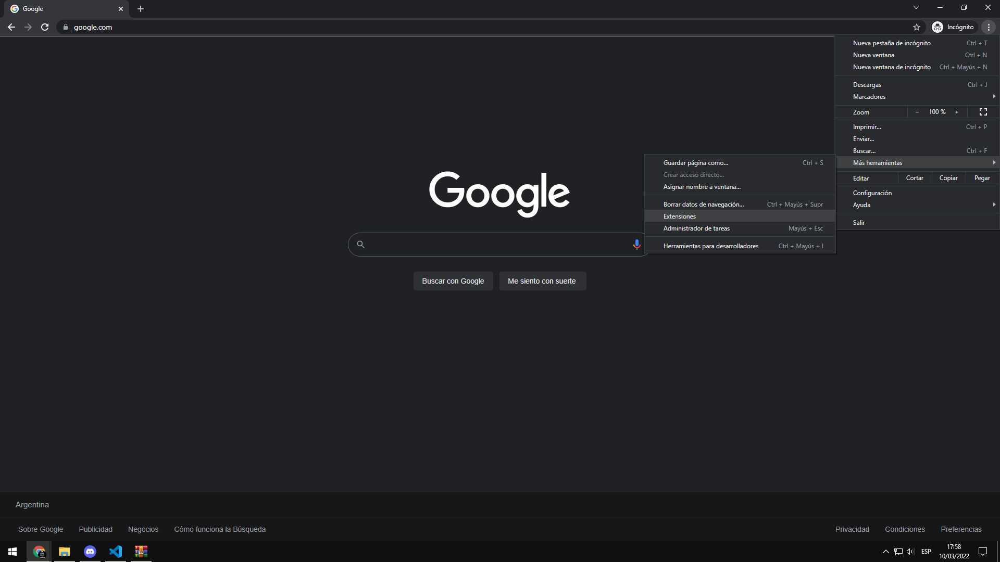
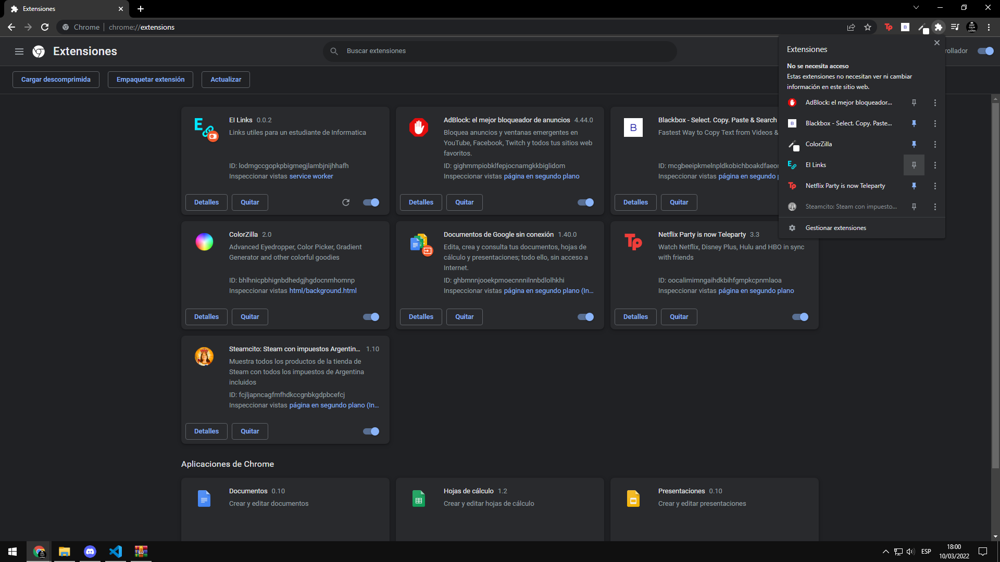
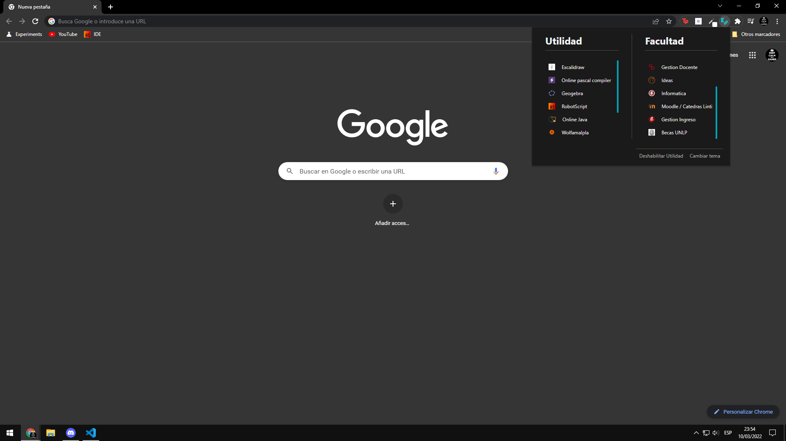

    

# EI-Links

Esta es una pequeña extension creada con el fin de facilitar el descubrimiento y facil acceso de algunas paginas/ herramientas/ apps de utilidad como estudiante de carreras de la facultad de Informatica UNLP.

 
 

## Instalacion

Hay dos tutoriales para la instalacion:

- [Rapido | Resumido](#tutorial-resumido)

- [Extendido | Paso a paso](#tutorial-extendido)

 

### Tutorial resumido

1. Descargar el archivo [**EI Links.rar**](https://github.com/MITH-arg/EI-Links/blob/main/EI%20Links.rar)

1. Descomprimirlo en la carpeta donde quedara guardada la extension

1. Abrir el navegador, ir a las opciones de extensiones y activar el modo desarrollador

1. Cargar descomprimida, buscar la carpeta donde se guardo la extension

1. Habilitar la extension si no lo esta y fijarla en la barra

 

### Tutorial extendido

1. **Descargar la extension**

    Primero hay que descargar el archivo que contiene la extension. Para ello la manera mas sencilla es:

    - Abrir el archivo [EI Links.rar](https://github.com/MITH-arg/EI-Links/blob/main/EI%20Links.rar) de este repositorio
    
    - Una vez abierto darle a ***descargar*** | ***download***

    

1. **Guardar la extension**

    - Abrir el archivo **EI Links.rar** descargado

    - Descomprimirlo

    - Guardarlo en un lugar de preferencia

    > Recomendacion guardarlo en la una carpeta llamada **Extensiones Customs** dentro de la carpeta de documentos

    

1. **Configurar el navegador**

    - Abrir el navegador

    - Ir a configuraciones, mas herramientas, extensiones

    

     
    
    - Habilitar el modo desarrollador

    > Esquina superior derecha
    
    

1. **Cargar la extension**

    - Ir a cargar descomprimida

    - Buscar la carpeta descomprimida donde se guardo y seleccionarla

    

1. **Configuracion final**

    - Si no figura como activa (*boton derecho dentro del cuadro de la extension esta gris*), darle al boton

    - Ir a el apartado de extensiones en la barra superior y fijarla

    

1. **Ya esta lista para usar**

    

